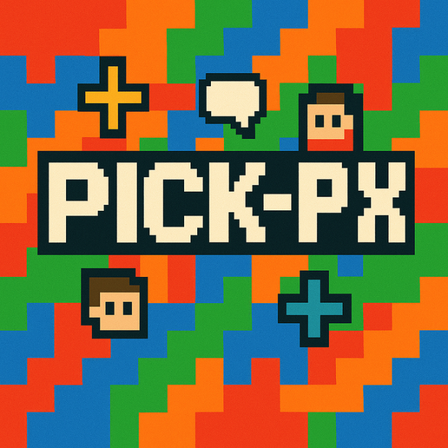

<div align="center">
  
</div>

# Pick-PX Frontend

실시간 픽셀 아트 협업 플랫폼의 프론트엔드 입니다.

## 📋 프로젝트 소개

Pick-PX는 사용자들이 실시간으로 함께 픽셀 아트를 그릴 수 있는 협업 플랫폼입니다.
캔버스 공유, 실시간 채팅, 게임 모드 등 다양한 기능을 제공합니다.

### 주요 기능

- 🎨 **실시간 픽셀 아트 캔버스**: 다중 사용자가 동시에 픽셀을 그릴 수 있는
  협업캔버스
- 💬 **실시간 채팅**: 캔버스 내에서 실시간으로 소통할 수 있는 채팅 기능
- 🎮 **게임 모드**: 퀴즈를 통한 게임형 캔버스 경험
- 👥 **그룹 시스템**: 캔버스를 그룹 단위로 관리하고 공유
- 📱 **반응형 디자인**: 데스크톱과 모바일 환경 모두 지원
- 🔐 **OAuth 로그인**: Google 로그인 지원
- 🎵 **사운드 효과**: BGM 및 효과음으로 몰입감 있는 경험 제공

## 🛠 기술 스택

### Frontend Framework

- **React 19.1.0** - 사용자 인터페이스 구축
- **TypeScript 5.8.3** - 타입 안전성 보장
- **Vite 7.0.0** - 빠른 개발 서버 및 빌드 도구

### UI & Styling

- **Tailwind CSS 4.1.11** - 유틸리티 기반 CSS 프레임워크
- **React Responsive** - 반응형 디자인 구현
- **React Slick** - 이미지 캐러셀 컴포넌트

### State Management

- **Zustand 5.0.6** - 경량 상태 관리 라이브러리

### Networking & Communication

- **Axios 1.10.0** - HTTP 클라이언트
- **Socket.io Client 4.8.1** - 실시간 웹소켓 통신

### Routing

- **React Router DOM 7.6.3** - 클라이언트 사이드 라우팅

### Utilities

- **JWT Decode 4.0.0** - JWT 토큰 디코딩
- **React Toastify 11.0.5** - 토스트 알림
- **Use Sound 5.0.0** - 사운드 효과 관리

### Development Tools

- **ESLint** - 코드 품질 관리
- **Prettier** - 코드 포맷팅
- **Vitest** - 단위 테스트
- **Testing Library** - React 컴포넌트 테스트

## 📁 프로젝트 구조

```
src/
├── api/                    # API 클라이언트
├── assets/                 # 정적 자산 (이미지, 아이콘)
├── auth/                   # 인증 관련 컴포넌트
├── components/             # 재사용 가능한 컴포넌트
│   ├── album/             # 앨범 관련 컴포넌트
│   ├── canvas/            # 캔버스 관련 컴포넌트
│   ├── chat/              # 채팅 관련 컴포넌트
│   ├── game/              # 게임 관련 컴포넌트
│   ├── group/             # 그룹 관련 컴포넌트
│   ├── modal/             # 모달 컴포넌트
│   └── toast/             # 토스트 알림 컴포넌트
├── hooks/                  # 커스텀 React 훅
├── pages/                  # 페이지 컴포넌트
├── router/                 # 라우팅 설정
├── services/               # 서비스 레이어
├── store/                  # Zustand 상태 관리
├── utils/                  # 유틸리티 함수
└── workers/                # Web Worker
```

## 🚀 설치 및 실행

### 필수 요구사항

- Node.js 18.0.0 이상
- npm 또는 yarn

### 설치

```bash
# 의존성 설치
npm install
```

### 개발 서버 실행

```bash
# 개발 모드로 실행
npm run dev
```

개발 서버는 기본적으로 `http://localhost:5173`에서 실행됩니다.

### 빌드

```bash
# 프로덕션 빌드
npm run build
```

### 미리보기

```bash
# 빌드된 결과물 미리보기
npm run preview
```

### 테스트

```bash
# 단위 테스트 실행
npm run test

# 테스트 UI 실행
npm run test:ui
```

### 코드 품질

```bash
# ESLint 검사
npm run lint
```

## 🔧 환경 설정

### 환경 변수

프로젝트 루트에 `.env` 파일을 생성하고 다음 변수들을 설정하세요:

```env
VITE_API_BASE_URL=http://localhost:3000
VITE_SOCKET_URL=http://localhost:3000
```

### 백엔드 연결

이 프론트엔드는 NestJS 백엔드와 연동됩니다. 백엔드 서버가 실행 중이어야
정상적으로 작동합니다.

## 📱 주요 컴포넌트

### Canvas System

- `PixelCanvas.tsx` - 메인 픽셀 캔버스 컴포넌트
- `CanvasUI.tsx` - 캔버스 UI 컨트롤
- `StarfieldCanvas.tsx` - 별자리 배경 효과

### Game System

- `GameCanvas.tsx` - 게임 모드 캔버스
- `QuestionModal.tsx` - 퀴즈 모달
- `GameTimer.tsx` - 게임 타이머

### Chat System

- `Chat.tsx` - 실시간 채팅 컴포넌트
- `MessageList.tsx` - 메시지 목록
- `MessageInput.tsx` - 메시지 입력

### Modal System

- `Modal.tsx` - 기본 모달 컴포넌트
- `LoginModalContent.tsx` - 로그인 모달
- `GroupModalContent.tsx` - 그룹 관리 모달

## 🔌 API 통신

### API 클라이언트

- `apiClient.ts` - Axios 기반 HTTP 클라이언트
- `CanvasAPI.ts` - 캔버스 관련 API
- `GameAPI.ts` - 게임 관련 API
- `GroupAPI.ts` - 그룹 관련 API

### WebSocket 통신

- `socketService.ts` - Socket.io 클라이언트 설정
- `useSocket.ts` - WebSocket 커스텀 훅
- `useChatSocket.ts` - 채팅 소켓 훅
- `useGameSocket.ts` - 게임 소켓 훅

## 🎨 스타일링

이 프로젝트는 Tailwind CSS를 사용하여 스타일링됩니다:

- 유틸리티 클래스 기반 스타일링
- 반응형 디자인 지원
- 다크/라이트 모드 지원 (필요시)

## 🧪 테스트

```bash
# 모든 테스트 실행
npm run test

# 테스트 커버리지 확인
npm run test:coverage

# 테스트 UI 실행
npm run test:ui
```

## 🤝 기여하기

1. 이 저장소를 포크합니다
2. 새로운 브랜치를 생성합니다 (`git checkout -b feature/amazing-feature`)
3. 변경사항을 커밋합니다 (`git commit -m 'Add some amazing feature'`)
4. 브랜치에 푸시합니다 (`git push origin feature/amazing-feature`)
5. Pull Request를 생성합니다

## 📄 라이선스

이 프로젝트는 MIT 라이선스 하에 배포됩니다.

## 📞 지원

문제가 발생하거나 질문이 있으시면 이슈를 생성해 주세요.

---

**Pick-PX Frontend** - 함께 그리는 픽셀 아트의 세계 🌟
